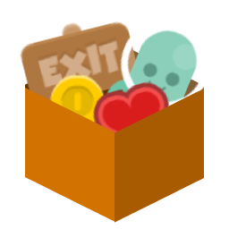
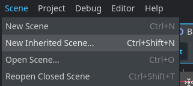
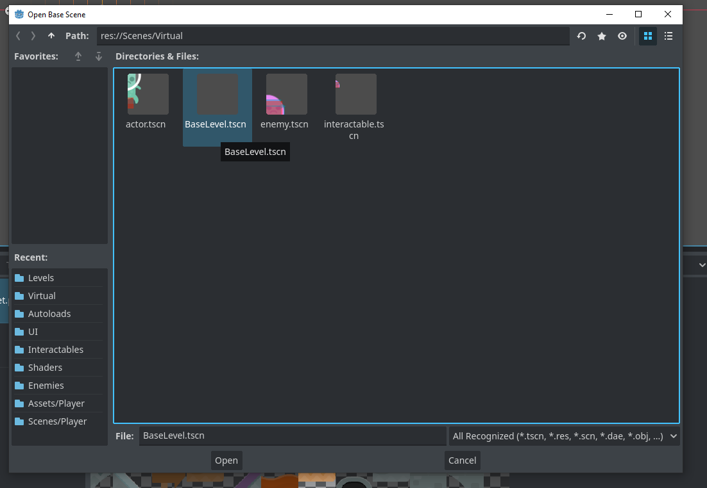
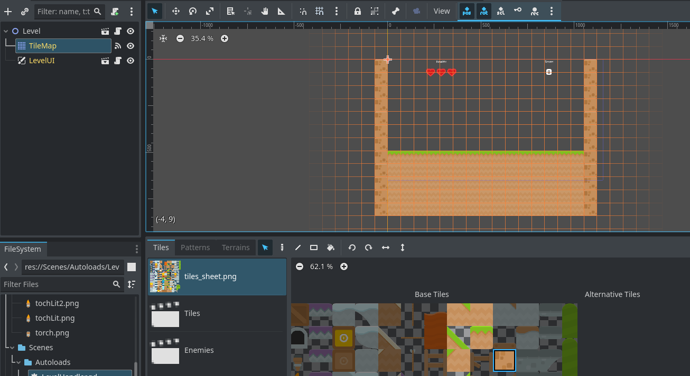
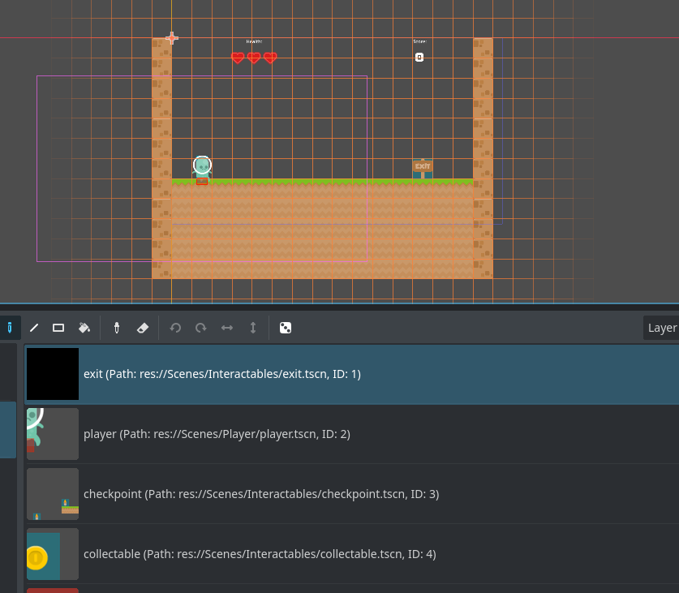

This template is designed to help users create 2D platformers in Godot quickly and easily using the improved Tilemap system of Godot 4, 
especially the ability to place scenes. The goal is for this to be both a beginner-friendly template to support new developers or
those who aren't too comfortable with coding while also providing a base for more experienced developers who want to quickly create
a fairly large project, say for a Gamejam. 

### Credits

Assets from Kenney Game Assets - <https://www.kenney.nl/assets/platformer-art-deluxe>

Coyote Time taken from Kids Can Code - <https://kidscancode.org/godot_recipes/4.x/2d/coyote_time/index.html>

### Includes

- Base Level
- Base Enemy
  - Crawler Enemy
  - **NEW** Flying Enemy
- Interactables
  - Level Exit
  - Collectables
  - Death Zones
  - **NEW** Crate
- Player with basic movement including:
  - Coyote Frames
  - Jump Buffer
  - Jump height depends on how long you press jump for
- Collisions between Enemies and Player
- Basic UI

### How To Install

Simply download, extract and open in Godot. You can try out the test levels or simply begin creating!

### How To Create A Level

#### Step 1

Click on "New Scene From Inherited"

#### Step 2

Choose "Base Level" as your base scene

#### Step 3

Click on the tile map, and begin to add the tiles to your level

#### Step 4

Click on the Tiles Scene Collection, and begin to add in the extra scenes. 
Make sure to add a player and a level exit!

#### Step 5

To add your levels to the level select, as well as order your levels, you need to edit the "level_collection.tres" resource, which contains the resource of your level. In the future, you will be able to find this in the main scene inspector, but for now you can access it from the file handler. Once you have it, you can add "MetaLevelResource"s, which contain the name of the level, the scene and level data. 

### How To Make It Your Own

You can simply edit the assets as you need to! Change the tile set of the base level, or change the character art of the player!

